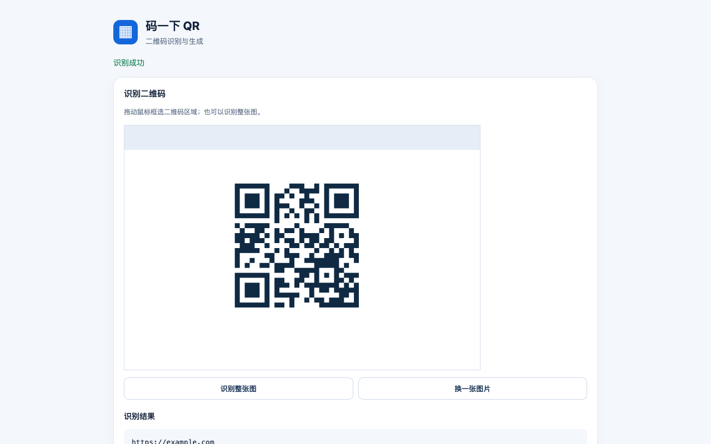

# QR Snap / 码一下 QR

[简体中文](README.md) · [English](README.en.md)

Recognize QR codes in website images from the right-click menu, scan a selected area of the visible page, and generate QR codes for URLs, links, or selected text. Processing stays in the browser; no account or server is required.

> The current `main` branch contains the bilingual v0.2.0 source. The submitted v0.1.0 store package still has a Chinese interface; the bilingual interface will be delivered in a later store update. Download the packaged [v0.1.0 release](https://github.com/dushaobindoudou/qr-snap-extension/releases/tag/v0.1.0) or load the latest source below.



## Features

- **Scan an image from the context menu:** right-click a website image and select “码一下 QR → 识别这张图片的二维码”. The extension captures the visible tab and scans the image area first.
- **Select a screen area:** capture the visible tab from the toolbar or context menu, then drag over the QR code in the result page. You can also scan the entire capture.
- **Generate QR codes:** encode the current page URL, custom text, a link, or selected text. Copy the image or download it as PNG.
- **Scan a local image:** upload an image for local scanning. Copy the decoded text or choose to open a decoded link.

## Install and develop

You need Node.js 20.19+, npm, and Chrome or Chromium.

```bash
npm ci
npm run build
```

Open `chrome://extensions`, enable **Developer mode**, choose **Load unpacked**, and select this repository's `dist` directory.

```bash
npm run check    # Check JavaScript syntax
npm test         # Build and run browser integration tests
npm run package  # Produce the Chrome Web Store ZIP
```

The tests require Playwright Chromium. If it is not installed locally, run `npx playwright install chromium`.

## Repository layout

| Path | Purpose |
| --- | --- |
| `src/background.js` | Context menus, capture, and result-page entry |
| `src/popup.js`, `popup.html` | Toolbar popup |
| `src/result.js`, `result.html` | Scanning, area selection, and generation UI |
| `src/qr.js` | QR encoding and decoding |
| `public/manifest.json` | Extension manifest and permissions |
| `tests/` | Browser integration tests |
| `store/` | Store screenshots and promotional art |

## Permissions and privacy

`activeTab` accesses the current tab only after a user action; `contextMenus` provides right-click actions; `scripting` locates the clicked image; and `storage` temporarily passes capture data to the result page. The extension does not request access to every website or send images, URLs, selected text, or scan results to the developer or third parties. Read the [English privacy policy](PRIVACY.en.md).

## Known limits

Captures cover only the visible viewport and do not scroll the page. Automatic image positioning may fail if an image is obscured, outside the viewport, or inside a cross-origin iframe; select the area manually or upload the image instead. The scanner supports standard QR Codes, not barcodes or Data Matrix.

## Contribute

Issues and pull requests are welcome. Read the [contribution guide](CONTRIBUTING.en.md) and [security reporting guide](SECURITY.md) first. Documentation and the v0.2.0 source interface support Simplified Chinese and English; the extension interface follows Chrome's language.
